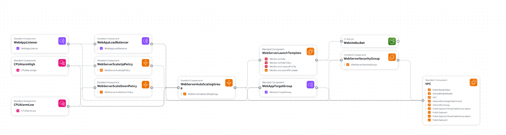
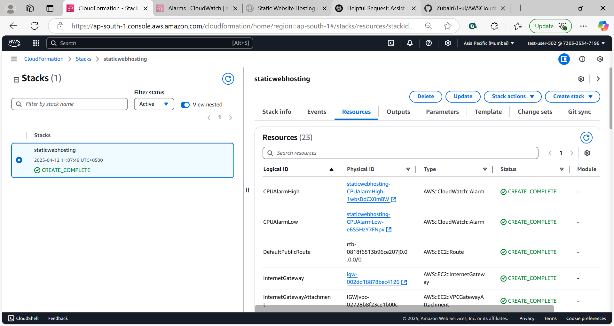

Static Website Hosting with High Availability on AWS

This project demonstrates how to host a static website on AWS using EC2 instances behind an Application Load Balancer with Auto Scaling for high availability. The solution is automated using AWS CloudFormation, ensuring Infrastructure as Code (IaC) principles.

✨ Features

Hosts static website using Apache HTTP Server

Auto scaling to handle traffic spikes

Load balancer for distributing traffic

Content pulled from S3 bucket to EC2 on launch

IAM roles with least privilege access

UserData for automated configuration

🔧 Architecture Overview

S3: Stores index.html and website assets

EC2 Instances: Ubuntu-based, Apache installed

Auto Scaling Group: Ensures minimum and maximum number of instances

Application Load Balancer: Balances incoming traffic across EC2

IAM Role: Grants EC2 permission to read from S3

CloudFormation Template: Defines the entire stack

⚙️ Technologies Used

AWS CloudFormation

Amazon EC2

Amazon S3

Application Load Balancer (ALB)

IAM Roles

Auto Scaling Group

Apache Web Server (Ubuntu)

📝 Resource Creation via CloudFormation (YAML Template Overview)

1. VPC & Subnet Configuration

A custom VPC is created with multiple subnets across availability zones to support high availability.

2. Internet Gateway & Routing

An Internet Gateway is attached to the VPC.

A Route Table is created to allow internet access, and associated with public subnets.

3. Security Group

A security group is configured to allow HTTP (port 80) and SSH (port 22) access.

4. S3 Bucket Reference

Parameter allows users to input the S3 bucket name containing website content (index.html).

5. Launch Template

Defines EC2 instance configuration including:

Ubuntu AMI

Apache + AWS CLI installation

aws s3 sync to copy content from S3

Apache web server start & enable

6. Application Load Balancer (ALB)

ALB is created across public subnets with a target group pointing to EC2 instances.

A listener is configured to route HTTP traffic to target group.

7. Auto Scaling Group

Configured to launch EC2 instances based on the Launch Template.

Minimum and maximum instance count defined.

8. IAM Role & Instance Profile

IAM Role created with permission to access S3.

Instance Profile attached to EC2 instances via Launch Template.

⏳ Setup Steps

1. Prepare Your S3 Bucket

Upload your index.html to your S3 bucket:

aws s3 cp index.html s3://zubair-490-s-p/index.html
 ⚠️ Ensure your EC2 IAM Role has s3:GetObject and s3:ListBucket permissions.

2. Deploy CloudFormation Template

You can launch the stack using AWS Console or CLI:
aws cloudformation create-stack \
  --stack-name staticwebhosting \
  --template-body file://NewProjectAWSCFT.yml \
  --parameters ParameterKey=KeyName,ParameterValue=LAMP \
               ParameterKey=WebsiteBucket,ParameterValue=zubair-490-s-p \
  --capabilities CAPABILITY_NAMED_IAM

3. Check Stack Creation

Go to AWS CloudFormation Console

Verify that all resources were created

4. Access Your Website

Once stack creation is complete, visit the Load Balancer DNS name:
[!Website View](http://static-webap-f3anuwlaaugt-771760443.ap-south-1.elb.amazonaws.com/)

📄 License

This project is open-source and available under the MIT License.

🙏 Acknowledgements

Thanks to the AWS documentation and community examples that inspired and guided this project.
